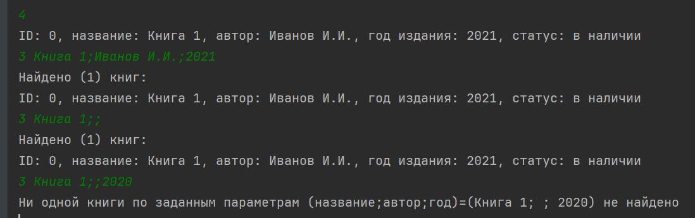

### Система управления библиотекой

---

Данная система позволяет хранить и обрабатывать данные о книгах. 
По каждой книге хранится следующая информация:
- уникальный идентификатор (задается системой)
- название книги
- автор
- год издания
- статус (выдана или в наличии)

##### Запуск приложения - команда "python main.py"

При запуске система запрашивает путь к файлу сохранения записей о книгах, 
при его отсутствии или некорректности будет инициализирована пустая библиотека.

Далее пользователь увидит меню команд и возможные параметры к ним, команды вводятся по следующему шаблону:
"<номер команды> некоторое количество пробельных символов (можно и не указывать) значения ожидаемых параметров, разделенные символов ';' (можно поменять в настройках приложения константу QUERY_PARAM_DELIMITER)"

##### Основные команды:
1. Добавить книгу

Команда добавление книги принимает на вход 3 обязательных аргумента (название, автор, год издания) и добавляет книгу в библиотеку, также заполняя уникальный идентификатор книги и статус (по умолчанию - "в наличии") 

В случае недостаточного количества аргументов или некорректности (например, год содержит что-то кроме цифр) - пользователю будет сообщено об ошибке

2. Удалить книгу

Команда удаления книги принимает на вход 1 обязательный аргумент (идентификатор книги) и удаляет книгу из библиотеки

В случае недостаточного количества аргументов или некорректности (книги с таким идентификатором нет в библиотеке) - пользователю будет сообщено об ошибке

3. Поиск книг

Команда поиска книг принимает на вход 3 аргумента (название, автор, год издания), обязателен хотя бы 1 любой из них.

В случае отсутствия аргументов или некорректности (например, год содержит что-то кроме цифр) - пользователю будет сообщено об ошибке.

Поиск производится по соответствию всем указанным критериям, при этом для строк проверяется вхождение запроса пользователя в данные книги, для года издания - полное совпадение.
Если книг не будет найдено по критериям запроса - будет выдано сообщение "Ни одной книги по заданным параметрам (название;автор;год)=(...) не найдено"

4. Отображение всех книг

Команда отображения книг не принимает аргументов и печатает данные всех доступных в библиотеке книг.

В случае отсутствия выводит сообщение "Пока ни одной книги не добавлено в библиотеку"

5. Изменение статуса книги

Команда изменения статуса принимает на вход 2 обязательных аргумента (идентификатор книги, статус) и меняет статус книги в библиотеке.
В случае отсутствия аргументов или некорректности (например, книги с указанным идентификатором нет, либо статус не входит в список ["в наличии", "выдана"]) - пользователю будет сообщено об ошибке.

6. Загрузка книг из JSON файла
7. Выгрузка книг в JSON файл

Обе команды принимают на вход 1 обязательный аргумент (путь сохранения файла).

Команда загрузки книг позволяет получить данные по ранее записанным книгам с диска, в случае успеха текущие книги будут утеряны, а книги из сохранения восстановятся в памяти системы, при неудаче - будет сообщено об ошибке и текущие книги сохранятся.

Команда выгрузки сохраняет данные книг в виде словаря в JSON файл с возможностью последующей загрузки из него, в случае неверного пути/ошибки чтения будет отображена соответствующая ошибка в консоли.

8. Меню

Команда отображает список всех команд и формат их ввода

9. Выход

Команда закрывает приложение БЕЗ сохранения текущих книг!

Также к любой команде можно добавить ключевое слово "помощь" после номера команды - тогда будет отображен пример ее корректного использования.

---
Модуль tests.py содержит небольшой набор тестов для системы.

book.py - класс для создания экземпляров книг

library.py - класс управления книгами в библиотеке